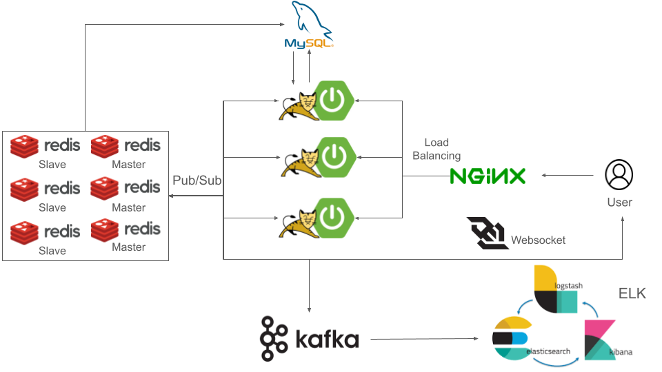

# 실시간 채팅 채팅 서비스

## 프로젝트 개요
Java Spring 기반의 실시간 채팅을 가능하게 하는 서버입니다.

웹소켓을 활용하여 실시간으로 메시지를 주고받으며, Spring Security와 JWT를 이용해 사용자 인증을 처리합니다. 

Nginx를 활용한 로드 밸런싱과 Redis 클러스터링으로 시스템의 고가용성과 확장성을 강화하였습니다.

로깅 데이터에 대한 효율적인 관리를 위해 Kafka와 ELK를 사용하여 로그 데이터의 실시간 모니터링 및 관리가 가능하게하였습니다.

#### 기술 스택
Java, Spring Framework, Docker, Docker-compose, WebSocket, Spring Security, JWT, Nginx, Redis, Redis Clustering, Kafka, ELK Stack (Elasticsearch, Logstash, Kibana)

## 서버 구조도

## 프로젝트의 주요 관심사
#### 공통사항
- 지속적인 성능 개선
- 명확한 메소드와 클래스명 명명

#### 대용량 트래픽 대응을 위한 성능 최적화
- 서버 부하를 줄이기 위해 Nginx를 활용하여 로드밸런싱
- SPOF를 해결하기 위해 Redis Cluster 구축

#### 실시간 채팅 시스템
- Redis를 이용해 실시간 메시지를 일시로 저장하고 일괄처리하여 DB에 저장

#### 로깅 데이터에 대한 효율적인 관리
- Kafka를 통해 대량의 로그 데이터를 효과적으로 수집
- ELK스택을 사용하여 중앙 집중식으로 로그 데이터의 실시간 모니터링 및 관리

#### 테스트
- Mockito를 활용하여 고립된 테스트 코드를 작성
- JMeter를 사용하여 성능 테스트

## 주요 기능
- 회원가입 및 로그인: 사용자 회원가입 및 로그인 기능을 제공하며, JWT 토큰을 발급하여 인증을 처리.
- 채팅방 개설 및 참여: 사용자가 채팅방을 개설하고 참여할 수 있는 기능.
- 실시간 채팅: WebSocket을 통해 실시간 메시지 전송.
- 로드밸런싱: Nginx를 이용한 서버 로드밸런싱.
- Redis Pub/Sub: Redis를 이용한 메시지 이벤트 처리.
- 로그 관리: AOP를 활용한 서비스 로깅 및 Kafka를 통한 ELK 전송.
